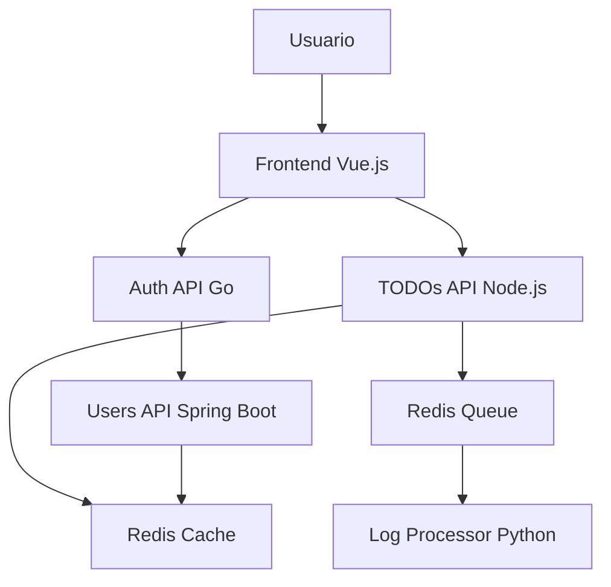

# Arquitectura del Sistema - Microservicios

## **Visión General**

Sistema de TODO con arquitectura de microservicios, diseñado para ser resiliente, escalable y mantenible.

## **Componentes del Sistema**

### **1. Frontend (Vue.js)**

- **Puerto**: 8080
- **Responsabilidad**: Interfaz de usuario
- **Tecnología**: Vue.js 2.x
- **Comunicación**: REST API con Auth y TODOs

### **2. Auth API (Go)**

- **Puerto**: 8081
- **Responsabilidad**: Autenticación y autorización JWT
- **Tecnología**: Go + Echo framework
- **Dependencias**: Users API para validación

### **3. Users API (Spring Boot)**

- **Puerto**: 8083
- **Responsabilidad**: Gestión de usuarios y perfiles
- **Tecnología**: Java + Spring Boot
- **Base de datos**: H2 (en memoria)

### **4. TODOs API (Node.js)**

- **Puerto**: 8082
- **Responsabilidad**: CRUD de tareas TODO
- **Tecnología**: Node.js + Express
- **Comunicación**: Redis para logging

### **5. Log Message Processor (Python)**

- **Responsabilidad**: Procesamiento de logs desde Redis
- **Tecnología**: Python
- **Comunicación**: Redis queue

## **Flujo de Datos**

## **Infraestructura en Kubernetes**

### **Namespaces**

- `microservices-staging`: Ambiente de pruebas
- `microservices-prod`: Ambiente de producción

### **Recursos por Microservicio**

- **Deployment**: Replicas configurables
- **Service**: Exposición interna
- **ConfigMap**: Configuración no sensible
- **Secret**: JWT secrets, passwords
- **Ingress**: Exposición externa

### **Redis Separado**

- **Redis-Queue**: Para procesamiento de logs
- **Redis-Cache**: Para cache de usuarios

## **Seguridad**

### **Autenticación JWT**

- **Algoritmo**: HS256
- **Expiración**: 72 horas
- **Claims**: username, firstname, lastname, role

### **Comunicación Interna**

- **Protocolo**: HTTP/HTTPS
- **Validación**: JWT en headers
- **Rate Limiting**: Por servicio

## **Observabilidad**

### **Tracing**

- **Herramienta**: Zipkin
- **Cobertura**: Todos los microservicios
- **Métricas**: Latencia, errores, throughput

### **Logging**

- **Centralizado**: Redis queue → Log processor
- **Formato**: JSON estructurado
- **Niveles**: INFO, WARN, ERROR

### **Métricas**

- **Kubernetes**: CPU, memoria, pods
- **Aplicación**: Requests/segundo, latencia p95
- **Infraestructura**: Redis, base de datos

## **Patrones de Nube Implementados**

### **1. Circuit Breaker**

- **Implementación**: gobreaker (Go), opossum (Node.js)
- **Propósito**: Evitar cascadas de fallos
- **Configuración**: 5 fallos → abrir, 30s → half-open

### **2. Cache-Aside**

- **Implementación**: Redis + Spring Cache
- **Propósito**: Mejorar performance de consultas
- **TTL**: 30-60 segundos

### **3. Autoscaling**

- **HPA**: TODOs API (CPU > 70%)
- **KEDA**: Log Processor (queue length > 10)
- **Límites**: 1-10 pods por servicio

## **Configuración por Ambiente**

### **Staging**

- **Replicas**: 1 por servicio
- **Recursos**: 100m CPU, 128Mi RAM
- **Base de datos**: H2 en memoria

### **Producción**

- **Replicas**: 2-5 por servicio
- **Recursos**: 200m CPU, 256Mi RAM
- **Base de datos**: PostgreSQL persistente

## **Escalabilidad**

### **Horizontal**

- **Kubernetes HPA**: Basado en CPU/memoria
- **KEDA**: Basado en métricas de Redis
- **Load Balancer**: Distribución de tráfico

### **Vertical**

- **Resource Limits**: Configurables por servicio
- **Quality of Service**: Guaranteed/Burstable

## **Resiliencia**

### **Health Checks**

- **Liveness**: `/health` endpoint
- **Readiness**: `/ready` endpoint
- **Startup**: `/startup` endpoint

### **Fault Tolerance**

- **Circuit Breaker**: Protección contra fallos
- **Retry**: Reintentos con backoff exponencial
- **Timeout**: Timeouts configurables por servicio
